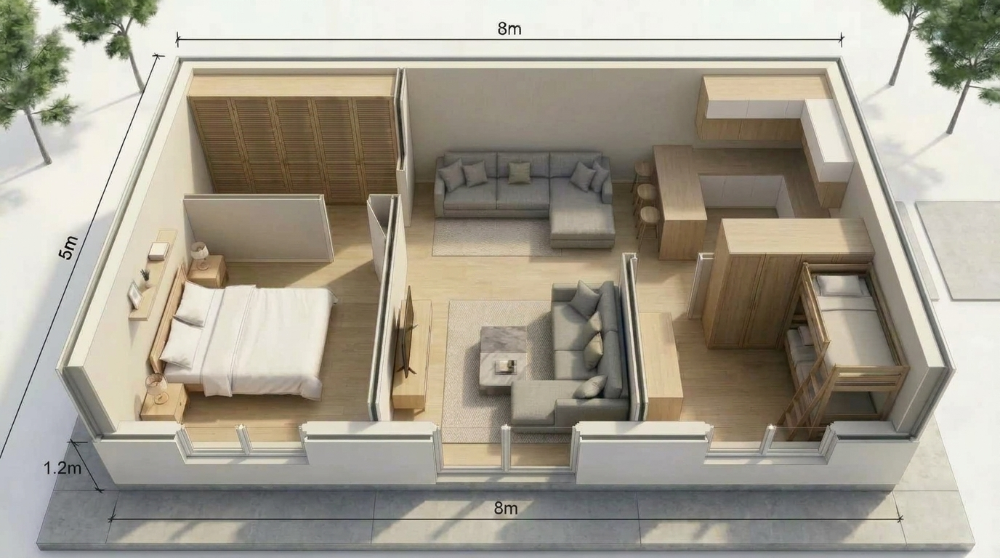

# 🇰🇪 JengaSmart — 5×8m (40m²) House Construction Cost Minimizer

An interactive web application and construction management suite designed specifically for building a **5.00m × 8.00m (40 m²)** 2-bedroom compact residential home in **Kenya**, optimizing every single shilling from foundation to roof.



---

## 🏗️ Project Overview

- **Footprint:** 8.00 m length × 5.00 m width (40 m² ground coverage)
- **Accommodation:**
  - Master Bedroom (2.90m × 2.80m) with Queen bed & 2.2m wardrobe
  - Kids' Bedroom (2.90m × 2.00m) with double-deck bunk bed & 1.6m wardrobe
  - Open Living Lounge (4.80m × 2.80m) with dual-zone sofa seating & wide 1.8m central walkway
  - Corner Storage Pantry Cabinets + 1.60m attached breakfast bar with 4 stools
  - Designed for external pit latrine / bio-digester washroom (zero internal plumbing odor)
- **Roof Design:** Traditional Gable (4.25m apex) or Modern Skillion Mono-Pitch (3.6m to 2.85m slope)

---

## 💡 Key Features for Cost Minimization

### 1. Preloaded Kenya Inventory & Deficit Engine
Pre-configured with your exact starting materials:
- **Clay Bricks:** 2,000 bricks on site (Foundation substructure covered; calculates remaining 5,000 deficit)
- **Mabati (G28 Iron Sheets):** 15 sheets on site (Deficit: 9 sheets to cover full 24-sheet roof)
- **Cement (50kg bags):** 20 bags on site (Deficit: 70 bags for remaining stages)
- **River Sand:** 10 tons on site (Covers foundation & brick walling)
- **Ballast (3/4"):** 3 tons on site (Covers strip footing)
- **D8 Ribbed Rebar & R6 Stirrups:** 100% covered for the 26m ring beam!
- **1000-Gauge Waterproof DPM:** 8 rolls on site (100% covered for slab barrier!)
- **Binding Wire:** 3 kg on site (100% covered!)

### 2. Tactical Cost-Cutting Levers (Save KES 100,000+)
Interactive switches that calculate real-world Kenyan construction savings:
- **Mono-Pitch (Skillion) Roof:** Saves ~KES 28,500 by eliminating 4 mabati sheets, ridge caps, and 30% timber trusses.
- **Direct-from-Quarry Delivery:** Saves ~KES 14,000 by purchasing a 14-tonne tipper direct from source instead of middleman pickups.
- **Milestone-Based Labor ("Kandarasi"):** Saves ~KES 25,000 by locking artisans into fixed milestone deliverables with 10% retention.
- **Dual Cement Grade Selection:** Saves ~KES 6,500 by using 32.5N cement for wall mortar/plaster instead of 42.5N.
- **Phased Finishing (Polished Screed):** Saves ~KES 43,000 by moving in with red oxide floor screed and deferring ceramic tiles.
- **Engineered 1.2m Truss Spacing:** Saves ~KES 16,000 on cypress purlins and struts.

### 3. Phase-by-Phase Cashflow Tracker
7 distinct construction phases with material requirements, cash targets, and completion checkboxes:
1. Setting Out & Foundation Strip Footing
2. Substructure Brick Walling & 100mm Floor Slab
3. Superstructure Brick Elevation to Ring Beam (2.8m)
4. Reinforced Concrete Ring Beam (200mm × 200mm)
5. Roof Framing & Mabati Installation
6. Steel Windows, Doors & External Plastering
7. Floor Screed Finish & Electrical 1st Fix

### 4. Interactive 2D & 3D Architectural Visualizer
- Clickable 2D SVG blueprint displaying room dimensions, furniture clearances, and electrical switch layouts.
- Top-down 3D architectural render.
- Main entrance perspective render.
- Gable vs Skillion roof comparison gallery.

### 5. Official Documents & Contracts
- **Hardware Deficit Purchase Requisition:** Auto-generates a clean list of only the materials you still need to buy.
- **Standard Kenya Artisan Milestone Contract ("Kandarasi"):** Printable formal legal agreement with milestone stages, timeline limits, material wastage penalties, and 10% retention clause.

---

## 🚀 How to Run Locally

No external dependencies or build tools required. Open directly in any browser:

```bash
# Clone the repository
git clone https://github.com/kevorhyno90/jengasmart-5x8m-house-cost-optimizer.git

# Open the directory
cd jengasmart-5x8m-house-cost-optimizer

# Open index.html in your browser
# On Windows:
start index.html
# On macOS:
open index.html
# On Linux:
xdg-open index.html
```

Or serve with Python or any HTTP server:
```bash
python -m http.server 8000
```

---

## 🌐 Deploy to GitHub Pages

To view the live app online from anywhere on your phone or computer:
1. Go to your repository settings on GitHub: `https://github.com/kevorhyno90/jengasmart-5x8m-house-cost-optimizer/settings/pages`
2. Under **Build and deployment > Source**, select **Deploy from a branch**.
3. Select branch: `main`, folder: `/ (root)`, and click **Save**.
4. Your live app will be accessible at: `https://kevorhyno90.github.io/jengasmart-5x8m-house-cost-optimizer/`

---

## 📋 License

MIT License — free to use and customize for your own house construction project in Kenya.
